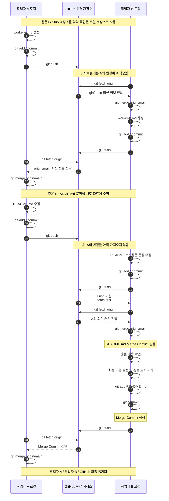

# Git 협업 실습 - Fetch, Merge 및 충돌 해결

## 실습 개요

하나의 GitHub 원격 저장소를 두 개의 로컬 저장소에 Clone하여  
작업자 A와 작업자 B가 협업하는 상황을 재현한다.

이번 실습에서는 다음 내용을 확인한다.

- 각 로컬 저장소는 서로 독립적으로 동작한다.
- 다른 작업자가 Push한 내용은 내 로컬에 자동으로 반영되지 않는다.
- `git fetch`로 원격 변경을 확인하고, `git merge origin/main`으로 로컬 브랜치에 반영한다.
- 같은 파일의 같은 부분을 수정하면 Merge Conflict가 발생할 수 있다.
- 충돌이 발생하면 직접 내용을 수정한 뒤 `add → commit → push` 순서로 해결한다. fileciteturn0file0L456-L470

---

## 실습 흐름



---

## 핵심 흐름

```text
작업자 A Push
    ↓
작업자 B Fetch
    ↓
Merge
    ↓
동일 파일 수정 시 충돌 발생
    ↓
충돌 해결
    ↓
git add
    ↓
git commit
    ↓
git push
    ↓
작업자 A 최종 동기화
```

> 핵심은 각 로컬 저장소가 서로 독립적이기 때문에  
> 다른 작업자의 변경사항을 직접 `fetch`하고 `merge`해야 한다는 점이다. fileciteturn0file0L506-L520
