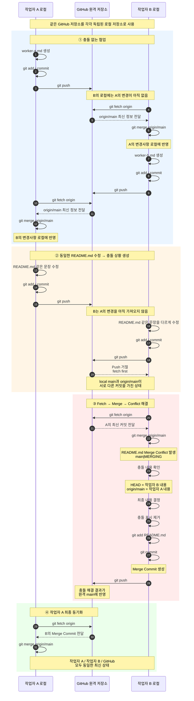

# Git 협업 실습 - Fetch, Merge 및 충돌 해결

## 실습 개요

하나의 GitHub 원격 저장소를 두 개의 로컬 저장소에 Clone하여  
**작업자 A와 작업자 B가 협업하는 상황**을 재현한다.

이번 실습에서는 다음 과정을 통해 Git 협업의 전체적인 흐름을 이해한다.

- 서로 다른 파일을 수정하며 충돌 없는 협업 진행
- `fetch`와 `merge`를 이용한 원격 변경사항 동기화
- 동일한 파일의 같은 부분을 수정하여 Merge Conflict 발생
- 충돌 해결 후 Merge Commit 생성 및 Push
- 최종적으로 두 작업자와 GitHub의 상태 동기화

---

## 실습 흐름



---

## 핵심 흐름

```text
[① 충돌 없는 협업]
