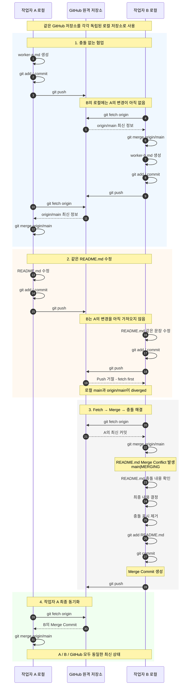

# Git 협업 실습 - Fetch, Merge 및 충돌 해결

## 1. 실습 개요

하나의 GitHub 원격 저장소를 두 개의 로컬 저장소에 Clone하여  
**작업자 A와 작업자 B가 협업하는 상황**을 재현한다.

각 로컬 저장소는 같은 GitHub 저장소와 연결되어 있지만 서로 독립적으로 동작한다.

```text
                GitHub 원격 저장소
                       │
              ┌────────┴────────┐
              │                 │
         fetch / push       fetch / push
              │                 │
              ▼                 ▼
       작업자 A 로컬        작업자 B 로컬
    /c/2026-git-start   /c/2026-git-start-b
```

이번 실습에서는 다음 두 가지 상황을 확인한다.

1. 서로 다른 파일을 수정하는 **충돌 없는 협업**
2. 같은 파일의 같은 부분을 수정하는 **Merge 충돌 상황**

---

## 2. 핵심 개념

### 로컬 저장소는 서로 독립적이다

작업자 A와 B는 같은 GitHub 저장소를 사용하지만 각자의 로컬 저장소는 독립되어 있다.

따라서 작업자 A가 파일을 수정하거나 Push했다고 해서  
작업자 B의 로컬 파일이 자동으로 변경되는 것은 아니다.

다른 작업자가 Push한 내용을 내 로컬 저장소에 반영하려면 다음 과정이 필요하다.

```bash
git fetch origin
git merge origin/main
```

### `git fetch`

원격 저장소의 최신 커밋 정보를 가져온다.

```bash
git fetch origin
```

하지만 `fetch`만 실행한다고 해서 현재 작업 중인 로컬 `main` 브랜치나 작업 파일이 바로 변경되는 것은 아니다.

### `git merge`

`fetch`를 통해 가져온 `origin/main`의 변경 내용을 현재 로컬 `main`에 병합한다.

```bash
git merge origin/main
```

즉 기본적인 동기화 흐름은 다음과 같다.

```text
GitHub 변경
    ↓
git fetch origin
    ↓
origin/main 갱신
    ↓
git merge origin/main
    ↓
로컬 main에 변경사항 반영
```

---

# 3. 전체 협업 흐름



---

# 4. 1차 실습 - 충돌 없는 협업

먼저 작업자 A와 B가 **서로 다른 파일을 수정**한다.

## 작업자 A

작업자 A가 `worker-a.md`를 생성하고 커밋한 뒤 GitHub에 Push한다.

```bash
git add worker-a.md
git commit -m "A: 작업자 A 문서 추가"
git push
```

이 시점에서 GitHub에는 A의 새로운 커밋이 존재하지만  
**작업자 B의 로컬 저장소에는 아직 해당 변경이 없다.**

---

## 작업자 B - A의 변경 가져오기

작업자 B는 원격 저장소의 변경사항을 가져온다.

```bash
git fetch origin
```

원격에만 존재하는 커밋을 확인할 수 있다.

```bash
git log --oneline main..origin/main
```

이후 원격 변경사항을 로컬 `main`에 병합한다.

```bash
git merge origin/main
```

이제 작업자 B의 로컬에서도 `worker-a.md`를 확인할 수 있다.

---

## 작업자 B

이번에는 작업자 B가 `worker-b.md`를 생성한다.

```bash
git add worker-b.md
git commit -m "B: 작업자 B 문서 추가"
git push
```

---

## 작업자 A - B의 변경 가져오기

작업자 A 역시 같은 방식으로 작업자 B의 변경사항을 가져온다.

```bash
git fetch origin
git merge origin/main
```

최종적으로 두 로컬 저장소와 GitHub에는 다음 파일이 모두 존재한다.

```text
README.md
worker-a.md
worker-b.md
```

서로 다른 파일이나 서로 다른 줄을 수정한 경우 Git이 자동으로 병합할 가능성이 높다.

---

# 5. 2차 실습 - 같은 파일 수정으로 충돌 발생

이번에는 작업자 A와 작업자 B가 `README.md`의 **같은 문장을 서로 다르게 수정**한다.

충돌 실습을 시작하기 전 두 작업자는 동일한 커밋 상태에서 시작한다.

기존 문장:

```text
오늘의 학습 목표: Git 협업 이해
```

---

## 작업자 A 수정

작업자 A는 다음과 같이 변경한다.

```text
오늘의 학습 목표: 작업자 A의 Git 협업 실습
```

그리고 커밋 후 먼저 Push한다.

```bash
git add README.md
git commit -m "A: README 학습 목표 수정"
git push
```

GitHub의 `origin/main`에는 이제 작업자 A의 변경사항이 존재한다.

---

## 작업자 B 수정

작업자 B는 **A의 변경사항을 아직 가져오지 않은 상태에서** 같은 문장을 수정한다.

```text
오늘의 학습 목표: 작업자 B의 Merge 충돌 실습
```

커밋한다.

```bash
git add README.md
git commit -m "B: README 학습 목표 수정"
```

그리고 Push를 시도한다.

```bash
git push
```

하지만 다음과 같이 Push가 거절된다.

```text
! [rejected] main -> main (fetch first)
```

### Push가 거절되는 이유

작업자 A와 B가 같은 공통 커밋에서 각각 다른 커밋을 만들었기 때문이다.

```text
                 A의 README 수정
                /
공통 커밋
```
