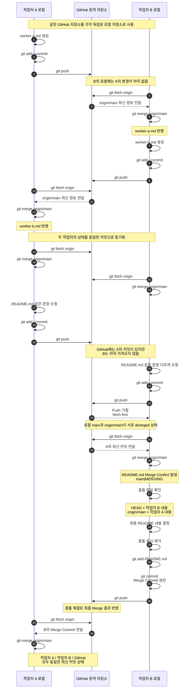

```mermaid
sequenceDiagram
    autonumber

    participant A as 작업자 A 로컬
    participant GH as GitHub 원격 저장소
    participant B as 작업자 B 로컬

    Note over A,B: 같은 GitHub 저장소를 각각 독립된 로컬 저장소로 사용

    %% 1. 충돌 없는 협업
    A->>A: worker-a.md 생성
    A->>A: git add / commit
    A->>GH: git push

    Note over GH,B: B의 로컬에는 A의 변경이 아직 없음

    B->>GH: git fetch origin
    GH-->>B: origin/main 최신 정보 전달
    B->>B: git merge origin/main
    Note over B: worker-a.md 반영

    B->>B: worker-b.md 생성
    B->>B: git add / commit
    B->>GH: git push

    A->>GH: git fetch origin
    GH-->>A: origin/main 최신 정보 전달
    A->>A: git merge origin/main
    Note over A: worker-b.md 반영

    %% 2. 충돌 실습 준비
    Note over A,B: 두 작업자의 상태를 동일한 커밋으로 동기화

    A->>GH: git fetch origin
    A->>A: git merge origin/main

    B->>GH: git fetch origin
    B->>B: git merge origin/main

    %% 3. 동일한 README 수정
    A->>A: README.md 같은 문장 수정
    A->>A: git add / commit
    A->>GH: git push

    Note over GH,B: GitHub에는 A의 커밋이 있지만<br/>B는 아직 가져오지 않음

    B->>B: README.md 같은 문장 다르게 수정
    B->>B: git add / commit
    B->>GH: git push

    GH-->>B: Push 거절<br/>fetch first
    Note over B,GH: 로컬 main과 origin/main이 서로 diverged 상태

    %% 4. Fetch 및 Merge 충돌
    B->>GH: git fetch origin
    GH-->>B: A의 최신 커밋 전달

    B->>B: git merge origin/main
    Note over B: README.md Merge Conflict 발생<br/>main|MERGING

    B->>B: 충돌 파일 확인
    Note over B: HEAD = 작업자 B 내용<br/>origin/main = 작업자 A 내용

    B->>B: 최종 README 내용 결정
    B->>B: 충돌 표시 제거
    B->>B: git add README.md
    B->>B: git commit<br/>Merge Commit 생성

    %% 5. 충돌 해결 결과 반영
    B->>GH: git push
    Note over GH: 충돌 해결된 최종 Merge 결과 반영

    %% 6. 작업자 A 최종 동기화
    A->>GH: git fetch origin
    GH-->>A: B의 Merge Commit 전달
    A->>A: git merge origin/main

    Note over A,GH: 작업자 A / 작업자 B / GitHub<br/>모두 동일한 최신 커밋 상태
```
